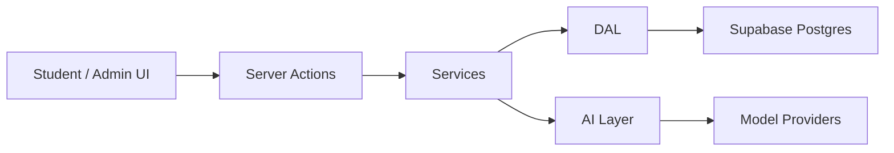

# Architecture Overview

This document summarizes the architectural decisions behind B Game without exposing sensitive internal code.

## System shape

B Game is a multi-tenant SaaS application with a strict layered architecture:

```text
UI -> Actions -> Services -> DAL
```

- `UI`: pages, layouts, and components
- `Actions`: mutation entry points with validation and permission checks
- `Services`: business orchestration
- `DAL`: typed database access only

## High-level diagram



## Multi-tenant model

The product is built around a strict hierarchy:

```text
organization -> game_session -> team -> gameplay data
```

Important invariants:

- every gameplay query is scoped by `session_id`
- student routes never expose `teamId`
- team context is derived server-side
- permissions rely on authenticated user identity, not client-supplied identifiers

## Routing model

Student routes follow a stable pattern:

```text
/student/[sessionId]/...
```

Admin routes follow:

```text
/admin/session/[sessionId]/...
```

This sounds simple, but keeping that boundary strict avoids a lot of accidental coupling between role scopes.

## Security model

The security model is based on Supabase Row Level Security.

Core principles:

- UI-accessible data is read and written through user-scoped clients
- service-role access is reserved for tightly controlled system contexts
- tenant isolation is enforced both in application code and database policies

The point is not only to "have auth". The point is to ensure data boundaries survive product growth.

## AI subsystem

AI capabilities are centralized behind a dedicated layer.

Why:

- prompts need versioned ownership
- provider calls should not spread across the app
- outputs must be validated before product logic consumes them
- provider switching or fallback should not force UI rewrites

Current AI use cases include:

- interview analysis
- prototype signal analysis
- scoring support
- structured review workflows

## AI provider resilience

The AI layer also includes a routing strategy for provider resilience.

The pattern is simple:

- one primary provider
- one optional fallback provider
- one force override for debugging, testing, or incident handling

In practice, that means the system can:

- use the default provider in normal operation
- retry the same capability through a second provider if the first one is unavailable
- force all traffic to a chosen provider when validating behavior or working around an outage

This is a useful operational practice because AI features should degrade in a controlled way. A product should not become unusable just because one provider is temporarily failing.

## Simulation engine

The market simulation is designed as a deterministic engine rather than a free-form AI output.

Design choices:

- snapshot-based round inputs
- append-only round results
- integer-first arithmetic for money and rates
- stable ordering and rounding rules
- testable pure simulation entry point

That matters because educational credibility and product trust both depend on repeatable outcomes.

## Finance subsystem

Finance is not just a spreadsheet-shaped page. It is a preparation layer for the simulation engine.

It covers:

- pricing and offer structure
- development choices
- marketing allocation
- 12-month projections
- P&L and treasury views

The finance data feeds round snapshots used by the simulation close process.

## Product operating model

The product is split into two large families:

1. Design Thinking and product building workflow
   Personas, empathy, needs, complexity / MVP, prototype, Business Model
2. Market simulation
   Finance, funding, rounds, market outcomes, evaluation

This lets the platform support both pedagogy and game mechanics without collapsing the whole system into a single generic workflow.

## Reliability and maintainability signals

The codebase includes patterns and practices that support reliability and maintainability:

- typed DB contracts
- centralized validation with Zod
- explicit permission helpers
- append-only records where auditability matters
- pure-function computation in finance and simulation
- dedicated tests for service logic, AI boundary behavior, and engine determinism

For concrete examples, see [CODE_EXCERPTS.md](./CODE_EXCERPTS.md).
